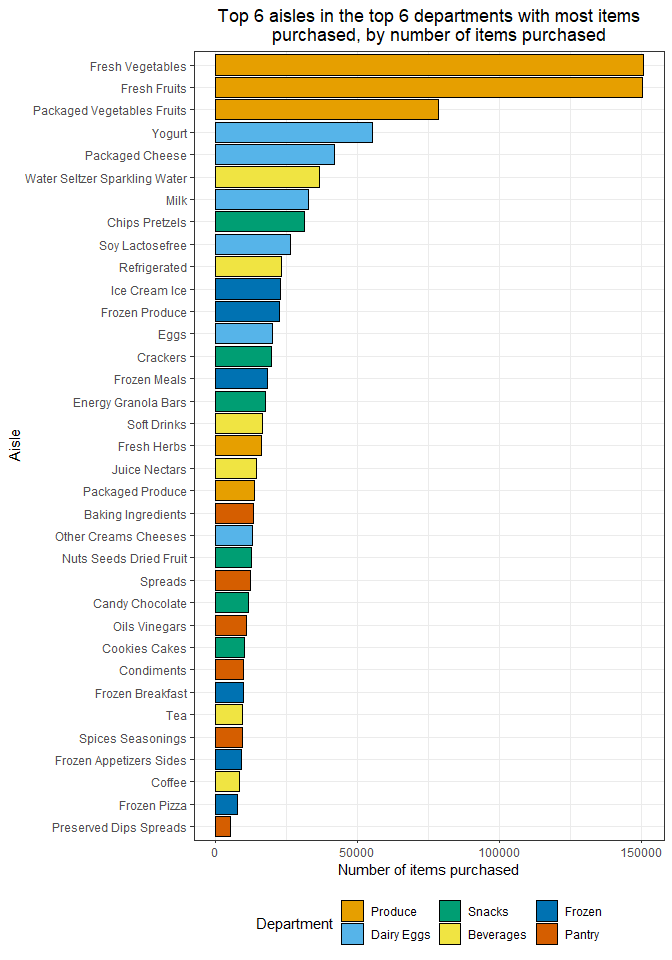

PubH7462 - Homework 3
================
Andrés Arguedas
17/2/2022

-   [Instacart](#instacart)

## Instacart

First, we will start by loading the `instacart.csv` file, located in the
`/data` folder into R as the `instacart` object:

``` r
# Load the data from `instacart.csv` into R as the `instacart` object, and
# change some variables for ease of use later
instacart <- read_csv("./data/instacart.csv") %>%
  # Change the `aisle`, `department`, and `product_name` to factors, for ease of
  # use, and also change the text in the `aisle` and `department` variables to
  # be more readable
  mutate(
    aisle = factor(aisle) %>% str_to_title(),
    department = factor(department) %>% str_to_title(),
    product_name = factor(product_name)
  )
```

Having loaded the data into R, we can proceed to create a first table to
summarize some of the variables of interest in the data set.
Specifically, we will

``` r
instacart %>%
  group_by(order_id, user_id) %>%
  summarise(
    days_since_last_order = min(days_since_prior_order),
    number_of_items = n(),
    number_of_aisles = length(unique(aisle_id)),
    number_of_departments = length(unique(department_id)),
    order_number = min(order_number),
    percent_reordered = sum(reordered) / n() * 100
  ) %>%
  ungroup() %>%
  dplyr::select(-order_id, -user_id) %>%
  summarise(across(.fns = list(mean = mean, median = median, sd = sd))) %>%
  pivot_longer(everything(),
    names_pattern = c("(.*)_([^_]+$)"),
    names_to = c("variable", ".value")
  ) %>%
  mutate(variable = str_replace_all(variable, "_", " ") %>%
    str_to_title()) %>%
  gt() %>%
  tab_header(
    title = "Overall mean, median, and standard deviation, for six variables of
    interest, for all customers' orders in the Instacart data"
  ) %>%
  cols_label(
    variable = md("**Variable**"), mean = md("**Mean**"),
    median = md("**Median**"), sd = md("**Std. Dev.**")
  ) %>%
  cols_align(align = "left", columns = variable) %>%
  cols_align(align = "center", columns = -variable)
```


``` r
instacart %>%
  group_by(aisle) %>%
  summarise(n = length(unique(order_id))) %>%
  mutate(aisle = fct_reorder(aisle, n)) %>%
  ggplot(aes(y = aisle, x = n, fill = n)) +
  scale_fill_gradientn(colors = c(
    "#FFF7EC", "#FEE8C8", "#FDD49E", "#FDBB84",
    "#FC8D59", "#EF6548", "#D7301F", "#B30000",
    "#7F0000"
  )) +
  geom_col(col = "black") +
  labs(title = "Total number of orders per aisle", x = "Number of orders", 
       y = "Aisle") +
  theme(legend.position = "none")
```

<!-- -->

``` r
top_6_dep <- instacart %>%
  group_by(department) %>%
  summarise(n_items_dep = n()) %>%
  arrange(desc(n_items_dep)) %>%
  slice_head(n = 6) %>%
  dplyr::select(department) %>%
  pull()

instacart %>%
  filter(department %in% top_6_dep) %>%
  group_by(department, aisle) %>%
  summarise(n_items_aisle = n()) %>%
  ungroup() %>%
  mutate(department = fct_reorder(department, n_items_aisle,
    .fun = sum,
    .desc = TRUE
  )) %>%
  group_by(department) %>%
  arrange(desc(n_items_aisle), by_group = TRUE) %>%
  slice_head(n = 6) %>%
  ungroup() %>%
  mutate(aisle = fct_reorder(aisle, n_items_aisle, identity)) %>%
  ggplot(aes(x = n_items_aisle, y = aisle, fill = department)) +
  geom_col(col = "black") +
  labs(
    title = "Top 6 aisles in the top 6 departments with most items
    purchased, by number of items purchased", 
    y = "Aisle", x = "Number of items purchased", fill = "Department"
  )
```

<!-- -->

``` r
top_5_aisle <- instacart %>%
  group_by(aisle) %>%
  summarise(n_items_purchased = n()) %>%
  mutate(product_name = "Total") %>% 
  arrange(desc(n_items_purchased)) %>%
  slice_head(n = 5)

instacart %>% filter(aisle %in% top_5_aisle$aisle) %>% 
  group_by(aisle, product_name) %>% 
  summarise(n_items_purchased = n()) %>% 
  ungroup() %>%
  bind_rows(top_5_aisle) %>% 
  mutate(aisle = fct_reorder(aisle, n_items_purchased,
    .fun = sum,
    .desc = TRUE
  )) %>% 
  group_by(aisle) %>% 
  arrange(desc(n_items_purchased)) %>% 
  slice_head(n = 6) %>% 
  gt() %>% 
  tab_header(title = "Top 5 items purchased in the 5 aisles with the most total 
             items purchased, by number of items purchased") %>% 
  data_color(
    columns = n_items_purchased,
    colors = scales::col_numeric(
      palette = c('#f7fcf5','#e5f5e0','#c7e9c0','#a1d99b','#74c476','#41ab5d','#238b45','#006d2c','#00441b'),
      domain  = c(0, max(top_5_aisle$n_items_purchased))
    )
  ) %>%
  cols_label(product_name = md("**Product**"),
             n_items_purchased = md("**Number of items purchased**")) %>% 
  tab_stubhead(label = md("**Aisle**")) %>%
  cols_align(align = "left", columns = product_name) %>% 
  cols_align(align = "center", columns = n_items_purchased) %>%
  tab_options(row_group.as_column = TRUE)
```


